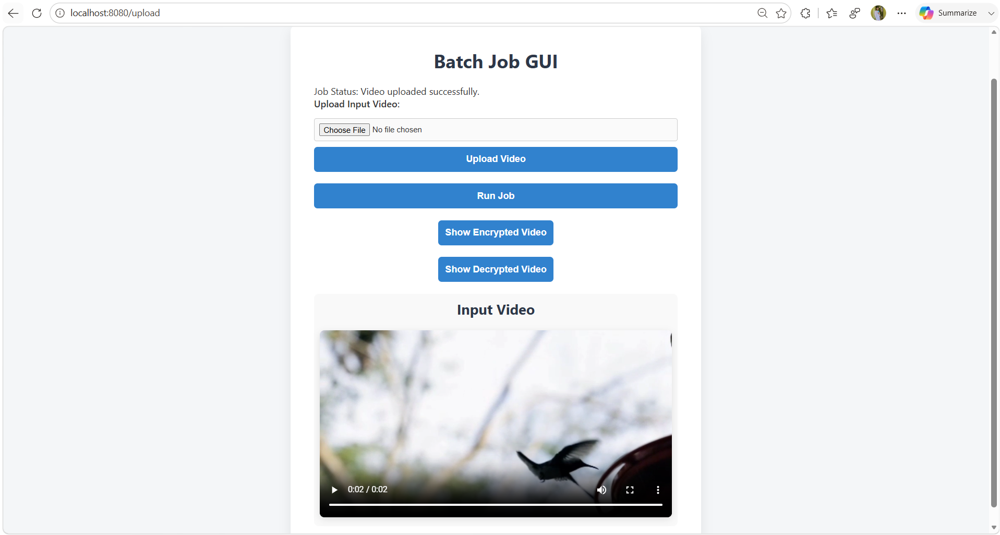
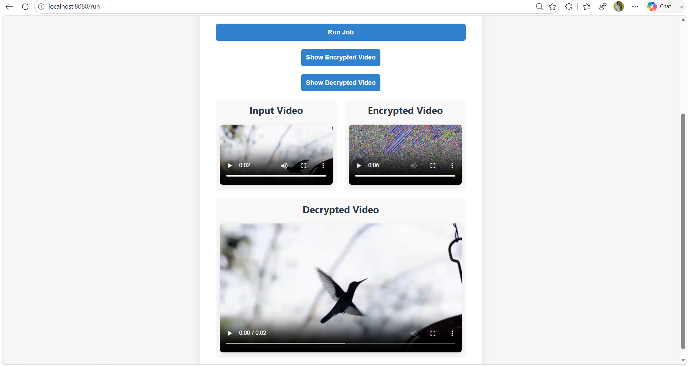

# 🎥 Video Cryptography

Secure video encryption and decryption system built using Java, Spring Boot, Docker, and OpenCV. This project focuses on protecting video data through cryptographic techniques while providing scalable backend architecture, REST APIs, automated testing, and containerized deployment.

---

# 🚀 Features

- 🔐 Secure video encryption and decryption
- 🎥 Video frame processing using OpenCV
- 🌐 REST API support with Spring Boot
- 🧪 Unit and integration testing using JUnit & Mockito
- 🐳 Docker containerization and deployment
- ⚡ CI/CD pipeline using GitHub Actions
- 📂 Secure file handling and processing
- 🖥️ Interactive web interface using Thymeleaf
- 🗄️ H2 Database integration for lightweight storage

---

# 🛠️ Tech Stack

## Backend
- Java 21
- Spring Boot 3.4.5
- Spring Web
- Spring Batch

## Frontend
- Thymeleaf

## Testing
- JUnit
- Mockito

## DevOps & Deployment
- Docker
- GitHub Actions
- Maven

## Libraries & Tools
- OpenCV
- Commons Codec
- Lombok
- H2 Database

---

# 📂 Project Structure

```bash
Video-Cryptography/
│
├── .github/
├── .mvn/
├── src/
│   ├── main/
│   │   ├── java/
│   │   ├── resources/
│   │   ├── static/
│   │   └── templates/
│   └── test/
│
├── screenshots/             
│   ├── home-page.png
│   ├── upload-video.png
│   └── encryption-decryption-result.png
│
├── decryptedVideo.mp4
├── encryptedVideo.mp4          (if present)
├── inputVideo.mp4              ( sample video)
│
├── .dockerignore
├── .gitattributes
├── .gitignore
├── Dockerfile
├── mvnw
├── mvnw.cmd
├── pom.xml
├── README.md
```

---

# ⚙️ Installation & Setup

## 1️⃣ Clone Repository

```bash
git clone https://github.com/your-username/Video-Cryptography.git
cd Video-Cryptography
```

---

## 2️⃣ Configure Java & Maven

Make sure you have:

- Java 21
- Maven 3.9+

Installed on your system.

Check versions:

```bash
java -version
mvn -version
```

---

## 3️⃣ Install Dependencies

```bash
mvn clean install
```

---

## 4️⃣ Run the Application

```bash
mvn spring-boot:run
```

Application will start on:

```bash
http://localhost:8080
```

---

# 🐳 Docker Setup

## Build Docker Image

```bash
docker build -t video-cryptography .
```

## Run Docker Container

```bash
docker run -p 8080:8080 video-cryptography
```

---

# 🔐 How It Works

1. Upload a video file
2. Frames are extracted using OpenCV
3. Encryption algorithm secures video frames
4. Encrypted data is processed and stored
5. Decryption reconstructs original video securely

---

# 🧪 Testing

Run all tests:

```bash
mvn test
```

Testing includes:

- Unit Testing
- Integration Testing
- API Validation
- Batch Processing Tests

---


# 📸 Application Screenshots

## 🏠 Home Page

The main interface where users can upload a video and start the encryption/decryption process.


---

## 📤 Video Upload

The uploaded video is displayed successfully before encryption.



---

## 🔐 Encryption & 🔓 Decryption Results

The system encrypts the uploaded video using AES and then successfully decrypts it to recover the original video.



# 📸 Applications

- Secure multimedia communication
- Defense and surveillance systems
- Cloud video protection
- Secure media sharing platforms
- Privacy-focused streaming systems

---

# 📈 Future Improvements

- AES-256 Advanced Encryption
- JWT Authentication
- Cloud Storage Integration
- Video Streaming Support
- AI-based Threat Detection
- Microservices Architecture

---

# 🤝 Contributing

Contributions are welcome.

```bash
1. Fork the repository
2. Create a new branch
3. Commit changes
4. Push your branch
5. Open a Pull Request
```

---


# 👨‍💻 Author

**Shambhav Kumar**

- GitHub: https://github.com/Itzshambhav
- LinkedIn: https://linkedin.com/in/shambhav-kumar-2aaa30212
